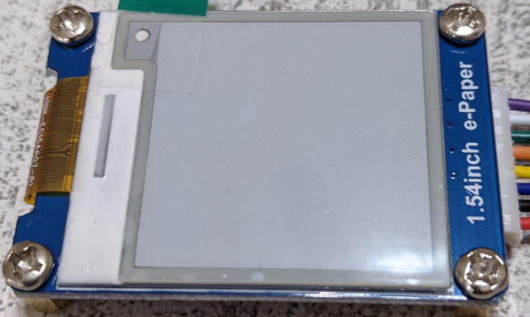
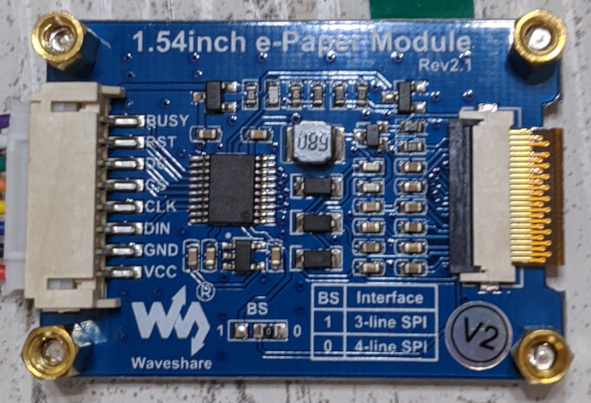
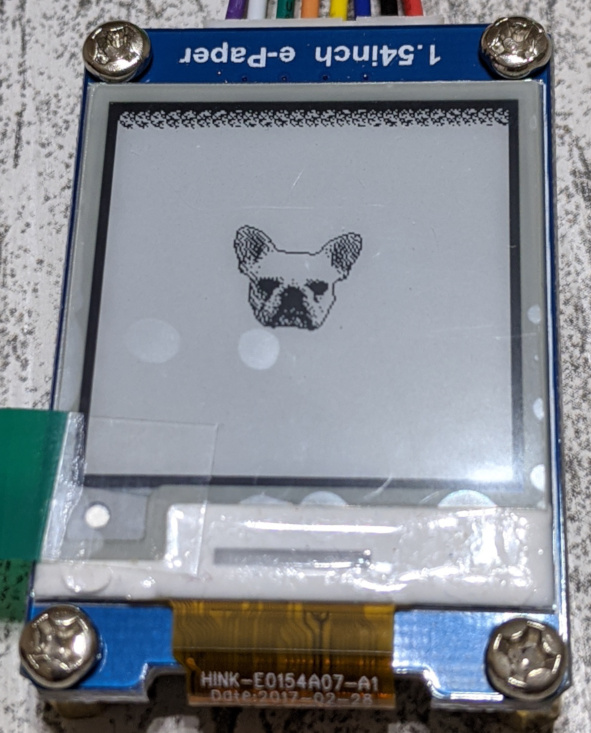

# 電子ペーパーディスプレイ

言語: [English](README.md)/日本語

## 開発ボード

私は[こちら](https://www.waveshare.com/product/displays/e-paper/epaper-3/1.54inch-e-paper-module.htm)をゲットしました。

前面。

.

裏面。

.


[こちら](https://www.waveshare.com/wiki/1.54inch_e-Paper_Module)に開発者用の情報があります。

## ピンアウト

以下は私の接続です。

| ESP32 Featherのラベル | Display |
|---------------------|---------|
| 3V                  | VCC     |
| GND                 | GND     |
| SCK                 | CS      |
| MO                  | CLK     |
| MI                  | N/A     |
| SDA                 | DIN     |
| A0                  | BUSY    |
| A1                  | RST     |
| 27                  | DC      |

[ESP32 Featherの回路図](https://learn.adafruit.com/assets/41630)もご覧ください。

SPIではないピンが3つあります。
- [DC](#dc)
- [RST](#rst)
- [BUSY](#busy)

### DC

Data Command Controlピン.

ESP32からのアウトプット。

DINからのビットを送るレジスタを選択します。
- Low: Command
- High: Data

### RST

Reset Signalピン.

ESP32からのアウトプット

Lowがアクティブ、つまりリセットする時にはLowにします。

### BUSY

BUSY State Outputピン.

ESP32へのインプット。

BUSYがHighの間はコマンドを送ってはいけません。

## プロトコル

[データシート](https://www.waveshare.com/w/upload/e/e5/1.54inch_e-paper_V2_Datasheet.pdf)には典型的なプロトコルが載っていますが、誤記と足りない情報が少しあるので注意が必要です。

この製品には2つのバージョンがあるようです。
私の開発ボードは裏側に **V2** マークがあるので、バージョン2のはずです。

### 3-wire SPI

BSピンがHighの場合、ディスプレイは3-wire SPI通信を行います。

3-wire SPIは試していません。

### 4-wire SPI

BSピンがLowの場合、ディスプレイは4-wire SPI通信を行います。
私の開発ボードの裏側を見ると、BSピンとGNDがショートしていました。
ということは4-wire SPIです。

ところで、この4-wire SPIは私の知っているものではありませんでした。
MISOピンを使わずDCピンを使います。

### タイミング

CPOL = CPHA = 0

## レファレンス

データシートはちょっと不正確ですが、幸いなことにいくつかサンプルプログラムがあります。
- [Raspberry Pi用のドライバ](https://github.com/waveshare/e-Paper/blob/master/RaspberryPi%26JetsonNano/c/lib/e-Paper/EPD_1in54_V2.c)
- [Raspberry Pi用のテストプログラム](https://github.com/waveshare/e-Paper/blob/master/RaspberryPi%26JetsonNano/c/examples/EPD_1in54_V2_test.c)

サンプルプログラムにはデータシートにリストされていないレジスタが2つあります。
- [`0x18`](#ドキュメントされていないレジスタ-0x18)
- [`0x3C`](#ドキュメントされていないレジスタ-0x3c)

### ドキュメントされていないレジスタ 0x18

[サンプルプログラム](https://github.com/waveshare/e-Paper/blob/8973995e53cb78bac6d1f8a66c2d398c18392f71/RaspberryPi%26JetsonNano/c/lib/e-Paper/EPD_1in54_V2.c#L150-L151)にあるレジスタ`0x18`に関するドキュメンテーションを見つけることはできませんでした。
サンプルコードではレジスタの値として`0x80`を設定しています。
レジスタはデータシートにドキュメントされていませんが、それがないとディスプレイはノイズだらけになります。

少し実験した後、分かったことがあります。
温度レジスタの値を手動で25℃に設定すると、`0x18`レジスタの設定がなくてもディスプレイはノイジーになりませんでした。
レジスタ`0x18`は温度センシング機能のコントロールをしているんでしょうか？

### ドキュメントされていないレジスタ 0x3C

レジスタ`0x3C`は[サンプルプログラム](https://github.com/waveshare/e-Paper/blob/8973995e53cb78bac6d1f8a66c2d398c18392f71/RaspberryPi%26JetsonNano/c/lib/e-Paper/EPD_1in54_V2.c#L147-L148)にありますが、1.54インチ版のデータシートにはドキュメントされていません。
しかし[似たような製品のデータシート](https://www.waveshare.com/w/upload/e/e6/2.9inch_e-Paper_Datasheet.pdf)にドキュメンテーションを見つけました。
このレジスタは *Border Waveform Control* で縁の色を決めるものです。

## サンプルプロジェクトをビルドする

以下のステップを実施してください。

1. [ESP-IDFの環境を準備します](../README-ja.md#esp-idf-準備のまとめ)。

2. プロジェクトをビルドします。

    ```
    idf.py build
    ```

3. プログラムをフラッシュに書き込みます。
   `$PORT`は皆さんのESP32が接続されているシリアルポートに置き換えてください。例: `/dev/cu.SLAB_USBtoUART`。

    ```
    idf.py -p $PORT flash
    ```

以下のような画像を表示するはずです。



## 注意

データシートによると、ディスプレイは24時間に一度リフレッシュしないといけません。
特に保管する際は、白で塗りつぶしておくべきです。

## バイナリイメージ変換ツール

指定した画像をバイナリイメージ(白黒の2値画像)に変換するPythonスクリプト[`make_binary_image.py`](py/make_binary_image.py)が[`py`](py)ディレクトリにあります。

### 使い方

`python py/make_binary_image.py -h`を実行すると、以下のようなメッセージが表示されるはずです。

```
usage: make_binary_image.py [-h] IMAGE

Convert image into a black and white binary image

positional arguments:
  IMAGE       path to an image to be converted

optional arguments:
  -h, --help  show this help message and exit
```

このスクリプトは`IMAGE`に指定した画像ファイルを白黒の2値画像に変換し、それをC言語のコードにコピペできるテキストとして出力します。
出力テキストはこんな感じです。

```c
static const uint8_t IMAGE_DATA[] = {
	0xF9u, 0xFFu, 0xFFu, 0xFFu, 0xFFu, 0xFFu, 0xFFu, 0xFFu,
	0xE6u, 0x3Fu, 0xFFu, 0xFFu, 0xFFu, 0xFFu, 0xFFu, 0xFFu,
	0xDDu, 0xCFu, 0xFFu, 0xFFu, 0xFFu, 0xFFu, 0xFFu, 0xFFu,
	0xB6u, 0xB3u, 0xFFu, 0xFFu, 0xFFu, 0xFFu, 0xFFu, 0xFFu,
	0x9Au, 0xADu, 0xFFu, 0xFFu, 0xFFu, 0xFFu, 0xFFu, 0x8Fu,
	0xADu, 0x56u, 0xFFu, 0xFFu, 0xFFu, 0xFFu, 0xFCu, 0x71u,
    ...
};
```

サンプルデータ[`main/image_data.h`](main/image_data.h)は以下の画像を変換したものです。

