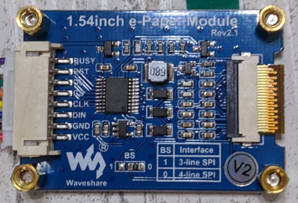

# E-Paper Display

Language: English/[日本語](README-ja.md)

## Development Board

I got [this](https://www.waveshare.com/product/displays/e-paper/epaper-3/1.54inch-e-paper-module.htm).

Front face.

.

Back side.

.


[Here](https://www.waveshare.com/wiki/1.54inch_e-Paper_Module) is information for developers.

## Pinouts

My hook-up is shown below.

| ESP32 Feather Label | Display |
|---------------------|---------|
| 3V                  | VCC     |
| GND                 | GND     |
| SCK                 | CS      |
| MO                  | CLK     |
| MI                  | N/A     |
| SDA                 | DIN     |
| A0                  | BUSY    |
| A1                  | RST     |
| 27                  | DC      |

See also the [ESP32 Feather Schematics](https://learn.adafruit.com/assets/41630).

There are three non-SPI pins,
- [DC](#dc)
- [RST](#rst)
- [BUSY](#busy)

### DC

Data Command Control pin.

Output from ESP32.

It selects a register to which bits are sent through a DIN pin.
- Low: Command
- High: Data

### RST

Reset Signal pin.

Output from ESP32.

Active Low; i.e., set Low when you want to reset.

### BUSY

BUSY State Output pin.

Input to ESP32.

Do not send any command during BUSY is High.

## Protocol

The [datasheet](https://www.waveshare.com/w/upload/e/e5/1.54inch_e-paper_V2_Datasheet.pdf) shows a typical protocol, but you need to be careful because it contains few errors and lacks some information.

It looks there are two versions of this product.
My development board should be the version 2, because there is a V2 mark on the back side of my board.

### 3-wire SPI

If a BS pin is High, the display does 3-wire SPI communication.

I have not tested 3-wire SPI.

### 4-wire SPI

When a BS pin is Low, it does 4-wire SPI communication.
When I looked at the back side of my development board, the BS pin and GND were shorted.
It means 4-wire SPI.

By the way, this 4-wire SPI was not what I knew.
It does not use a MISO pin but a DC pin.

### Timing

CPOL = CPHA = 0

## Reference

While the datasheet is a little inaccurate, fortunately there are some sample programs,
- [Driver for Raspberry Pi](https://github.com/waveshare/e-Paper/blob/master/RaspberryPi%26JetsonNano/c/lib/e-Paper/EPD_1in54_V2.c)
- [Test program for Raspberry Pi](https://github.com/waveshare/e-Paper/blob/master/RaspberryPi%26JetsonNano/c/examples/EPD_1in54_V2_test.c)

In the sample program, there are two registers that are not listed in the datasheet.
- [`0x18`](#undocumented-register-0x18)
- [`0x3C`](#undocumented-register-0x3c)

### Undocumented Register 0x18

I could not find any documentation about the register `0x18` that is found in the [sample program](https://github.com/waveshare/e-Paper/blob/8973995e53cb78bac6d1f8a66c2d398c18392f71/RaspberryPi%26JetsonNano/c/lib/e-Paper/EPD_1in54_V2.c#L150-L151).
The sample code sets `0x80` as data for that register.
While the register is not documented in the datasheet, the display gets noisy without it.

After some experiments, I came up with an idea.
When I manually set the temperature register (`0x1A`) value to 25℃, the display got no noise without the `0x18` register setting.
Does the register `0x18` control temperature sensing functionality?

### Undocumented Register 0x3C

The register `0x3C` that is found in the [sample program](https://github.com/waveshare/e-Paper/blob/8973995e53cb78bac6d1f8a66c2d398c18392f71/RaspberryPi%26JetsonNano/c/lib/e-Paper/EPD_1in54_V2.c#L147-L148) is not documented in the datasheet of the 1.54in version.
However I found documentation in the [datasheet of a similar product](https://www.waveshare.com/w/upload/e/e6/2.9inch_e-Paper_Datasheet.pdf).
It is a *Border Waveform Control* which determines the border color.

## Building Sample Project

Please take the following steps,

1. [Prepare an ESP-IDF environment](../README.md#esp-idf-preparation-summary).

2. Build the project.

    ```
    idf.py build
    ```

3. Write the program in to the flash.
   Please replace `$PORT` with the serial port connected to your ESP32; e.g., `/dev/cu.SLAB_USBtoUART`.

    ```
    idf.py -p $PORT flash
    ```

It will display an image similar to the following,


## Caution

According to the datasheet, the display has to be refreshed every 24 hours.
Especially when you store it, it should be whitened.

## Binary Image Converter

There is a Python script [`make_binary_image.py`](py/make_binary_image.py) in the [`py`](py) directory, that converts a given image into a black and white binary image.

### Usage

By running `python py/make_binary_image.py -h`, you will see messages similar to the following,

```
usage: make_binary_image.py [-h] IMAGE

Convert image into a black and white binary image

positional arguments:
  IMAGE       path to an image to be converted

optional arguments:
  -h, --help  show this help message and exit
```

This script converts an image file specified to `IMAGE` into a black and white binary image and prints the converted image as a text that can be copied and pasted to your C code.
An output text looks like

```c
static const uint8_t IMAGE_DATA[] = {
	0xF9u, 0xFFu, 0xFFu, 0xFFu, 0xFFu, 0xFFu, 0xFFu, 0xFFu,
	0xE6u, 0x3Fu, 0xFFu, 0xFFu, 0xFFu, 0xFFu, 0xFFu, 0xFFu,
	0xDDu, 0xCFu, 0xFFu, 0xFFu, 0xFFu, 0xFFu, 0xFFu, 0xFFu,
	0xB6u, 0xB3u, 0xFFu, 0xFFu, 0xFFu, 0xFFu, 0xFFu, 0xFFu,
	0x9Au, 0xADu, 0xFFu, 0xFFu, 0xFFu, 0xFFu, 0xFFu, 0x8Fu,
	0xADu, 0x56u, 0xFFu, 0xFFu, 0xFFu, 0xFFu, 0xFCu, 0x71u,
    ...
};
```

An example data [`main/image_data.h`](main/image_data.h) was converted from the following image,


## Faster Refresh Rate

It turned out that the refresh rate of my display was very slow, took about 2 seconds.

I googled for how to make it faster, and I found [this cool video](https://benkrasnow.blogspot.com/2017/10/fast-partial-refresh-on-42-e-paper.html).
Unfortunately the technique explained in the video was not applicable to my display though, it was so insightful that I could figure out what plays a role in determining a refresh rate.
It is a look-up-table (LUT).
First I needed a complete datasheet of the controller of my display to configure an LUT.
The actual manufacturerer of the display is [Good Display](https://www.good-display.com) and the controller of my display is `SSD1681`.
I downloaded the datasheet of `SSD1681` from (**CAUTION: non-SSL**) http://www.e-paper-display.com/download_detail/downloadsId=825.html.
Since the datasheet did not explain an LUT in details enough to configure it myself, I googled `SSD1681` and `LUT` next.
Then I got [this forum post](https://forum.arduino.cc/index.php?topic=487007.msg4440297#msg4440297) and I determined to give the display mode 2 a shot instead of configuring an LUT myself.

### Display Mode 2

It looks that the display mode 2 conducts fewer voltage updates than the display mode 1.
So it refreshes the display faster but causes slight ghosting.

As far as I tested it, it did not work well if I moved a window area; i.e., change X and Y ranges to update.
So I had to refresh the entire display at every frame.
To facilitate it, I implemented a simple [image_buffer](main/image_buffer.h) API.

[Here](https://youtu.be/6BAUQiaJMjU) I uploaded a video comparing the mode 1 and 2.

### Register 0x18

By the way, there is a description of the [register `0x18`](#undocumented-register-0x18) in the datasheet of `SSD1681`.
It controls the temperature sensor.
My guess was good, right?